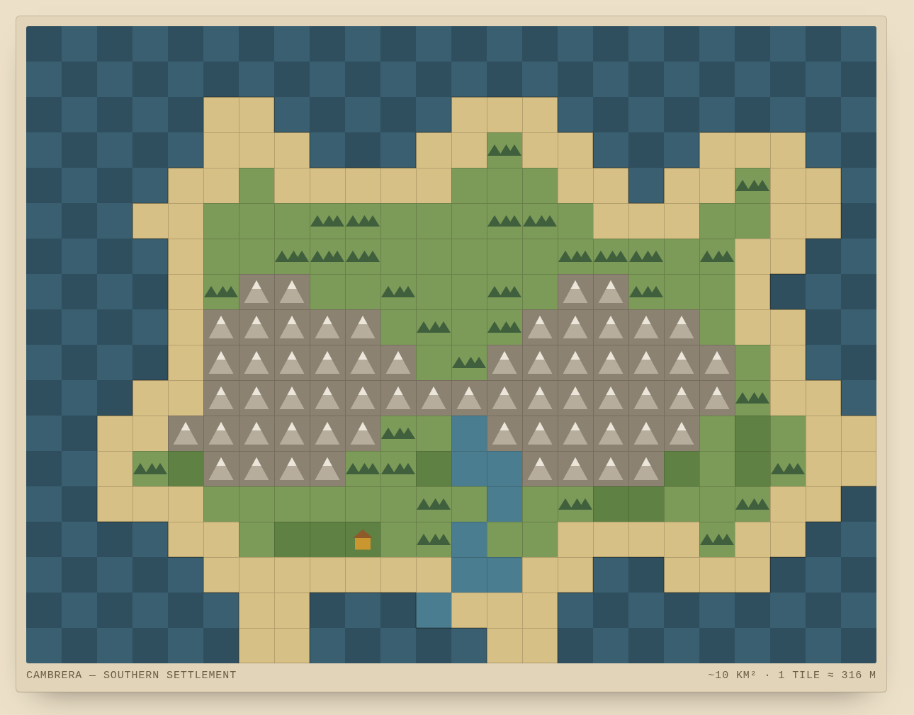

# Isle of Cambrera

*Single-player · turn-based · browser civ-builder · alpha v0.8.5*

Refugees of a continent-destroying war make landfall on a small northern island — and try to build something that lasts. One turn is one year. Every patch of land matters.

- **Play the alpha:** https://cambrera.digimente.xyz
- **Repository:** https://github.com/vicosurge/survival-civ-game
- **Roadmap / project board:** https://github.com/users/vicosurge/projects/1

---

## 1. About the game

**Isle of Cambrera** is a single-player, turn-based 2D civ-builder that runs in the browser. You land as a handful of settlers — five adults and two children off a small medieval ship — fleeing the war that destroyed the continent of Exarum, and you grow a settlement on the northern island of Cambrera toward a kingdom. There is no hard win condition; the soft goal is simply to endure and to grow.

Each year you allocate a small pool of workers across **farming, hunting, fishing, woodcutting, quarrying and scouting**, then raise buildings that give your surplus somewhere to go and counter specific threats — a granary against locusts, a palisade against bandits, a long house that unlocks houses, roads and civic governance. Pops age through **child, adult and elder** phases, so growth has to be earned: a newborn is a four-year productivity debt before it pays back. Fertile tiles matter, morale gates growth, merchants bargain over a wagon of cargo, and a **chronicle** of the years accumulates down the side of the screen.

The tone is deliberately **low-fantasy** — classical creatures exist but magic is fading, and the technological arc runs medieval to renaissance. Its lineage is openly retro: the allocate-and-live-with-it loop of 1968's *Hamurabi*, the build-a-civilisation arc of *Civilization*, and the "even poor land is worth something" ethos of *Master of Orion*. Population is kept abstract in the style of *Stellaris* — the UI never commits to a literal headcount.

> — Year 1 —
> Five adults and two children make landfall on the southern cove of Cambrera. The Balinger is hauled ashore; the first ground is broken before winter.

### Design pillars

- **The core loop** — Allocate scarce workers, live with the consequences a year at a time. The *Hamurabi* inheritance.
- **Pops age, not a counter** — Child → adult → elder. Births are earned against food and morale, never free.
- **Every tile matters** — Variable fertility and capacity mean poor land still has a use: outposts, roads, reach.

### Technical details

| | |
|---|---|
| **Platform** | Browser (desktop-first; mobile via Capacitor later) |
| **Language** | TypeScript (strict mode) |
| **Build** | Vite 5 |
| **Engine** | None — hand-rolled |
| **Rendering** | HTML Canvas (map) + DOM overlay (UI panels) |
| **Saves** | localStorage, single slot |
| **Backend** | Cloudflare Worker + D1 — alpha feedback only; the game itself is fully client-side |
| **Code licence** | GPL-2.0 |
| **Status** | Alpha · v0.8.5 · live |

---

## 2. Join the build

Cambrera has been a solo project and is now opening up to a small team. The engineering and design foundations are in place and playable — the biggest opportunities are on the **creative** side, where the visual and audio identity is still wide open. Here is where a volunteer can make the most difference, and how.

> 🖼️ *Image: optional — drop the role-card grid screenshot from the pitch page here.*

### Where a volunteer can have the most impact

| Role | What you'd own | The opportunity |
|---|---|---|
| 🎨 **Original art** | Terrain, buildings and UI on a 32px grid — the entire visual identity of the island | A blank canvas — the map runs on a procedural placeholder today, so the look is yours to define. An **art style guide is the natural first step.** |
| 🎵 **Music & sound** | An adaptive score for a quiet, contemplative builder, plus the sound-effects vocabulary to match | A single placeholder loop today and effects still to come — room to shape the whole audio feel. |
| 🎙️ **Voice acting** | Narration for the intro and pre-game departure sequence — the game's Infocom-style "feelies" | Not yet recorded, and deliberately scoped to intro + departure — a self-contained first piece. |

### Also open

| Role | What you'd own | Good for |
|---|---|---|
| **Engineering** | Gameplay systems, tooling and UI in TypeScript + Vite. No engine to learn — it's plain code | Anyone comfortable with typed JS who wants a clean, small codebase |
| **Game design** | Systems and balance. Tuning is data-driven — hunches get validated with Monte-Carlo sims before code | Systems thinkers who like spreadsheets as much as vibes |
| **Writing & lore** | Chronicle prose, events and worldbuilding within the established Exarum canon | Writers who can keep a consistent, understated voice |
| **QA & playtesting** | Play the live alpha and report back — in-game feedback and full-run chronicles ship straight to a dashboard | Anyone — no setup, just play the deployed build |
| **Production** | Milestone coordination, contributor onboarding, and keeping docs and roadmap honest as the team grows | Organisers who like shipping small, focused increments |

### How to get involved

1. **Play it first.** Try the alpha at https://cambrera.digimente.xyz and leave in-game feedback — it's the fastest way to understand the game.
2. **Read the docs.** Start with `CONTRIBUTING.md`, plus `CREDITS.md` and `docs/ASSET_PIPELINE.md` for creative work.
3. **Pick a lane.** Grab something from the discipline roadmap, or open an issue proposing what you'd like to own.
4. **Contribute via PR.** `main` is protected — one review approves a change. Code is GPL-2.0; creative assets are licensed per asset.
